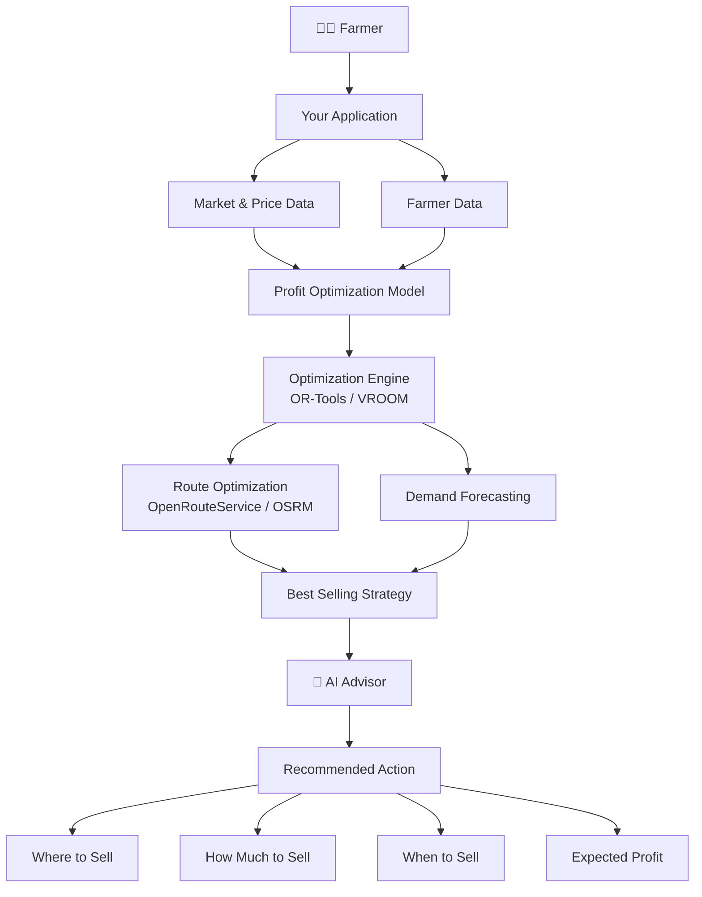

Show:

> **Buyer A: ₹30/kg**
> 

but

> **Recommended Buyer B: ₹28/kg**
> 

because after logistics:

> **B gives ₹2.70/kg more to the farmer.**
> 

### As market linkage challenges specifically identifies:

- lack of holding capacity after harvest
- lack of village-level warehousing/cold storage
- lack of safe transportation infrastructure
- inadequate information on demand/supply across markets
- difficulty persuading members to hold produce
- lack of confidence around price fluctuations.

This is extremely important.If we are able to solve this we are making the ecosytem of agriculture win win point..



### Priority 1 — Net-realization comparison

```
Buyer offer
+
logistics
+
other costs
↓
Actual farmer return
```

### 🔴 Priority 2 — FPO aggregation

```
many farmers
↓
one standardized lot
↓
large buyer
```

### 🔴 Priority 3 — Buyer trust

```
KYC
+
transaction history
+
quality evidence
+
delivery history
```

### 🔴 Priority 4 — Logistics execution

```
Farms
↓
collection points
↓
vehicle
↓
buyer
```

### 🔴 Priority 5 — Transaction/settlement

```
order
↓
shipment
↓
actual quantity/quality
↓
final settlement
```

### 🟡 Priority 6 — Price/demand prediction

Only once you have reliable transaction data.
