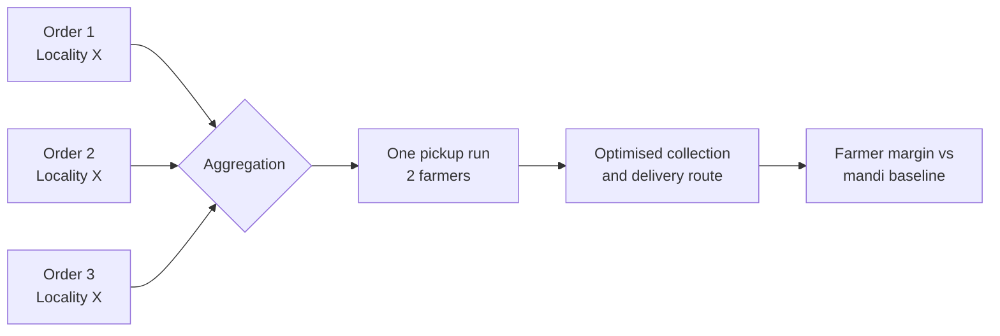
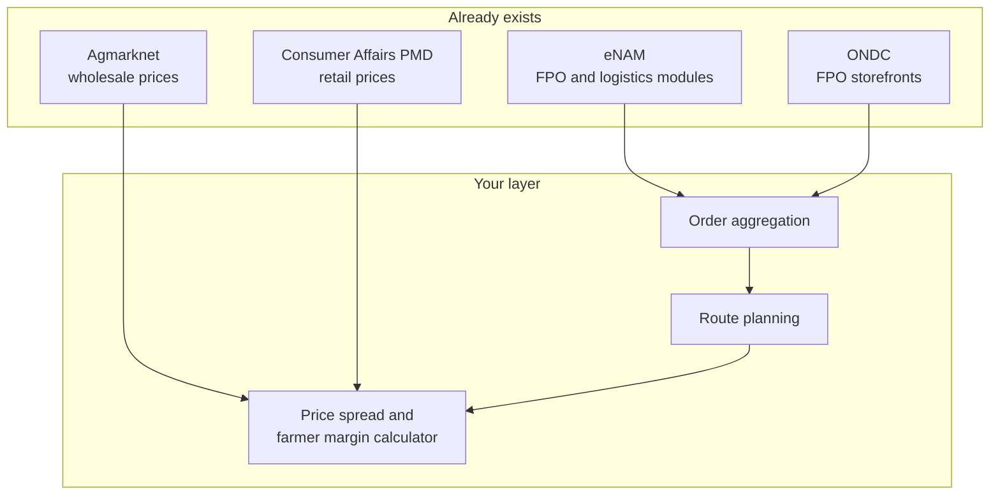

# SIH26033: Farmer-to-consumer marketplace review

**Multiple intermediaries reduce farmers' earnings and increase consumer prices**


| | |
|---|---|
| **Ministry** | Consumer Affairs, Food & Public Distribution |
| **Category** | Software |
| **Portal theme** | MedTech / BioTech / HealthTech (looks like a labelling quirk; confirm on the portal) |
| **Reviewed** | 20 September 2026 |

> [!WARNING]
> **Proceed with caution.** Acceptance potential is 1/5. The farmer-to-buyer marketplace is one of the most cloned hackathon ideas, and eNAM already runs it nationally. The only version worth pitching is not a marketplace: it is the **aggregation, routing and price-spread engine** behind one, built on official price data and plugged into eNAM and ONDC instead of competing with them.

**Jump to:** [The scores](#the-scores) | [In its favour](#in-its-favour) | [Against it](#against-it-in-detail) | [Data](#data-you-can-actually-get) | [Plan](#the-version-with-a-chance) | [Sources](#sources-and-caveats)

Base analysis by SIH Buddy (Ganeev Singh, AI first opinion by Claude Opus), lightly condensed. The "against" section, data section, positioning and checklist are added.

---

## What it actually is

Between the farmer and the person who eats the vegetable sit several traders, each taking a cut. The farmer earns little and the buyer still pays a lot. The ask is a marketplace where farmers and farmer groups (FPOs) sell straight to consumers and bulk buyers, and which also arranges transport and predicts what will sell.

> [!NOTE]
> Size of the problem, from an older parliamentary reply: 6 to 8 intermediaries in produce chains, and a 2004 Agriculture Ministry study putting the producer's share of the consumer's rupee at 32% to 68% for fruits, vegetables and flowers. It is dated, so find a recent figure before it goes on a slide.

## What to build

| Piece | What it means |
|---|---|
| **Seller onboarding** | Farmers and FPOs sign up |
| **Produce listings** | Quantity, grade and harvest window |
| **Buyer ordering** | Discovery and ordering for retail consumers and bulk buyers |
| **Order aggregation** | Small farmers' lots combine into one viable delivery |
| **Logistics layer** | Match orders to vehicles, compute multi-stop collection and delivery routes |
| **Demand forecasting** | Commodity-wise demand by area, so farmers see expected offtake before harvest |

## Smallest thing that wins the room

Place three consumer orders in one locality, watch them merge into a single pickup from two farmers, then show the optimised route and the margin the farmer keeps against a mandi baseline.



---

## The scores

| Score | Rating | Why |
|---|---|---|
| **Acceptance potential** | 🟥⬜⬜⬜⬜ **1/5** | Among the most cloned ideas at Indian hackathons, and eNAM already runs it nationally. You take the crowding penalty and the existing-solution penalty at once. |
| **Feasibility** | 🟩🟩🟩🟩⬜ **4/5** | Marketplace and routing are ordinary engineering with mature libraries, and Agmarknet gives real daily prices. Catch: no order history, no real farmers or vehicles, so two-sided liquidity is simulated. |
| **Innovation scope** | 🟨🟨🟨⬜⬜ **3/5** | The statement fixes the concept. The aggregation logic, routing formulation and forecasting approach are yours to design. |
| **Clarity** | 🟧🟧⬜⬜⬜ **2/5** | About 300 characters. It never names commodities, geography, the last-mile owner, payment or dispute handling, or what sets it apart from existing marketplaces. |
| **Effort** | 🟧 **Heavy** | Onboarding, listings, ordering and payments, plus aggregation, a vehicle-routing solver and a forecasting model: four substantial pieces, none novel alone. |
| **Demo-ability** | 🟨 **Medium** | A catalogue and checkout is something every judge has seen. The interesting moment, orders aggregating into a route, needs careful staging. |

### How crowded: busy

**220 to 500 teams expected.** Roughly 1 in 184 to 1 in 421 wins. Rank #199 of 240 by expected field (quieter than 17% of statements). The range reaches the 500-idea cap, so the statement can fill and close.

```
0                     220                  500 cap
░░░░░░░░░░░░░░░░░░░░░░▓▓▓▓▓▓▓▓▓▓▓▓▓▓▓▓▓▓▓▓▓▓▓▓▓▓▓▓
```

> [!NOTE]
> A projection from the 2025 statements, the last year with both submission counts and winners published. Nobody has published 2026 numbers. The model sees only software or hardware, theme and type of posting body, and explains about a quarter of the variation in 2025 field sizes (R² 0.25 on held-out statements). Trust the band more than the number. It cannot see how good your idea is. **Check the live counter on the SIH portal.**

---

## In its favour

> [!TIP]
> **Real public price data.** Agmarknet publishes daily wholesale mandi prices (minimum, maximum, modal) and arrivals for 300+ commodities, so price and margin claims can rest on official numbers.

> [!TIP]
> **Aggregation and routing is a real optimisation problem.** The one part where a team can show something technically real. Pickup clustering, vehicle capacity and time windows are yours to design.

> [!TIP]
> **The theme label thins the field slightly.** Filed under MedTech / BioTech / HealthTech, so agriculture teams browsing by theme may not find it.

> [!TIP]
> **The ministry already publishes retail prices** *(added)*. Consumer Affairs collects daily retail and wholesale prices for 38 essential commodities from 555 centres (as of February 2025). Pair that with Agmarknet wholesale prices to compute the retail-minus-wholesale spread from official sources, the number this ministry cares about.

> [!TIP]
> **The direction has policy backing** *(added)*. The FPO scheme, ONDC onboarding of FPOs and the Agriculture Minister's public support for farm-to-consumer selling (January 2025) mean judges are sympathetic to the goal. Your risk is novelty, not relevance.

---

## Against it, in detail

Ten risks, ordered roughly by how hard a judge will press. Tap a row to expand the full argument, the question to expect and the counter.

| Severity | Risk | A judge will ask |
|---|---|---|
| 🔴 High | You will be judged against a memory of near-identical decks | "How is this different from the apps I saw this morning?" |
| 🔴 High | eNAM already does this at national scale | "Why not build this inside eNAM?" |
| 🔴 High | The same model was tried, funded and shut down: Otipy | "A funded startup closed. Why does yours survive?" |
| 🔴 High | The hard problems are not software problems | "Who grades, who pays, who eats the loss?" |
| 🔴 High | The forecasting module is the weakest link | "What was this trained on?" |
| 🟠 Medium | ONDC and state markets already cover direct selling | "An FPO can already list on ONDC. What do you add?" |
| 🟠 Medium | A generic pitch misses this ministry's lens | "What happens to the consumer's price?" |
| 🟠 Medium | Both sides of the marketplace are simulated | "Is any of this real?" |
| 🟠 Medium | The statement is thin, so you are guessing | "Where did that assumption come from?" |
| 🟠 Medium | Heavy build, and the demo is easy to fumble | "Does it work live?" |

<details>
<summary><b>🔴 1. You will be judged against a memory of near-identical decks</b></summary>

*From SIH Buddy, expanded.*

Farmer-to-consumer marketplaces are among the most repeatedly submitted ideas at Indian hackathons, and this statement is projected to draw 220 to 500 teams. Most will arrive at the same catalogue-plus-checkout build, so your first slide looks like the last three the panel saw. The top of the range also touches the 500-idea cap, so the statement can fill and close before you finish deciding.

**A judge will ask:** *"How is this different from the farm-to-consumer apps I saw this morning?"*

> [!TIP]
> **Counter:** Do not open with the marketplace. Open with the one number a marketplace cannot fake: the farmer's retained margin against a mandi baseline, computed on real price data. Then show three orders merging into one route. Keep the storefront to a single slide.

</details>

<details>
<summary><b>🔴 2. eNAM already does this at national scale</b></summary>

*From SIH Buddy, expanded.*

eNAM links roughly 1,400 mandis across about 23 to 25 states and UTs (figures vary by source). Since 2022 it has worked as a "platform of platforms" that plugs in logistics aggregators, fintech, warehousing and FPO portals. It already has an FPO trading module where farmer groups list produce from their own collection centres and buyers bid remotely, a logistics module, and the Kisan Rath app for hiring vehicles. So onboarding, listings and vehicle booking all exist, run by government.

Its known weak spots are mostly not software. Study-note sources estimate only 30% to 40% of integrated mandis see active trading, trade stays largely within states, many mandis lack assaying labs, and traders resist the shift.

**A judge will ask:** *"Why not build this as a module inside eNAM?"*

> [!TIP]
> **Counter:** Say up front that you complement eNAM and ONDC: consume their FPO listings and price feeds and add what they lack. One candidate gap, your hypothesis to test rather than a fact, is consolidating small-lot pickups of fresh produce into single vehicle runs. Name the gap on slide two.

</details>

<details>
<summary><b>🔴 3. The same model was tried, funded and shut down: Otipy</b></summary>

*Added in this review.*

Otipy bought directly from farmers, sold through community group-buying, used demand prediction to cut wastage, and raised a $32 million Series B in 2022. It shut down in May 2025 when a further funding round fell through. Reporting points to capital-hungry last-mile delivery, thin margins on fresh produce, wastage risk, and customers moving to quick-commerce apps. That is this statement's model, forecasting module included, and a panel member who follows startups will know it.

**A judge will ask:** *"A funded startup built this and closed. Why does yours survive?"*

> [!TIP]
> **Counter:** Include a unit-economics slide: cost per delivered order, wastage, vehicle utilisation and the order density you need. Lean toward bulk and institutional buyers and fixed delivery windows, where drops are denser and baskets bigger than on-demand single orders. Be explicit that your demo runs on simulated numbers.

</details>

<details>
<summary><b>🔴 4. The hard problems are not software problems</b></summary>

*From SIH Buddy, expanded.*

A judge from this ministry will go straight to what the statement leaves out:

| Issue | What to settle |
|---|---|
| **Grading and disputes** | Who grades at pickup, what evidence settles a rejected lot (photo, weight, timestamp), who absorbs the loss |
| **Perishability** | Tomato and leafy vegetables lose value in days; onion and potato keep. Your pilot crops decide your wastage |
| **Payment timing** | Paid at pickup, on delivery, or after a return window; whether money sits in escrow |
| **Rules** | State APMC provisions, food-business registration and weights-and-measures rules vary by state. Check your pilot state |
| **Farmer access** | A voice, regional-language, WhatsApp or FPO-agent flow, not only a smartphone app |

> [!TIP]
> **Counter:** Put a one-slide table of operating assumptions covering each point, and build the smallest working version of two: dispute evidence capture and a payout hold. Both are cheap and show you thought past the app.

</details>

<details>
<summary><b>🔴 5. The forecasting module is the weakest link</b></summary>

*From SIH Buddy, expanded.*

Demand by commodity and area needs order history you do not have. Agmarknet gives wholesale prices and arrivals, which are supply-side and price signals rather than consumer demand. Training Prophet on synthetic orders proves nothing, and relabelling a price series as demand is a mistake a knowledgeable judge will catch. Practical snags too: one data.gov.in Agmarknet listing states that no API exists for it, and mandi data has gaps, reporting delays and inconsistent variety names. It is wholesale data, not farm-gate or retail.

**A judge will ask:** *"What was this trained on, and does it beat simply using last week's price?"*

> [!TIP]
> **Counter:** Rename it honestly, for example a price and arrivals outlook. Backtest on real history against a naive baseline (last week, or the same week last year) and report the error. A modest model that visibly beats a baseline is more credible than a fancy one with no test. Prove your data access path in the first hour.

</details>

<details>
<summary><b>🟠 6. ONDC and state markets already cover direct selling</b></summary>

*Added in this review.*

By March 2024 about 5,000 of roughly 8,000 registered FPOs had been onboarded on ONDC for online B2B and B2C sales. A seller guide (March 2026) says ONDC order volume is still far below the big e-commerce platforms and that it works best for shelf-stable goods, with fresh vegetables held back by weak cold-chain logistics. State-run direct-sale markets also exist, for example Rythu Bazaars (Andhra Pradesh and Telangana), Uzhavar Santhai (Tamil Nadu), Apni Mandi (Punjab and Haryana) and HOPCOMS (Karnataka). These names are from general knowledge; verify before citing.

**A judge will ask:** *"An FPO can already list on ONDC and get paid. What do you add?"*

> [!TIP]
> **Counter:** Make your seller and buyer flow ONDC-compatible, or say why not, and spend your effort on fresh-produce aggregation and dispatch, the part ONDC's own sellers describe as hard.

</details>

<details>
<summary><b>🟠 7. A generic pitch misses this ministry's lens</b></summary>

*Added in this review.*

The statement sits with Consumer Affairs, Food & Public Distribution, not Agriculture. Its daily concerns are consumer price levels, price spikes and availability of essential items, and its Price Monitoring Division tracks 38 commodities every day. A pitch about farmers earning more answers half the title. The other half is consumer prices.

**A judge will ask:** *"What happens to the consumer's price, and to price spikes?"*

> [!TIP]
> **Counter:** Report both sides for the same basket: the farmer's retained share and the change against the official retail price. Pick pilot crops from the ministry's own tracked list (potato, onion, tomato, brinjal and banana are the fresh-produce items) so your numbers can be checked against data the panel already trusts.

</details>

<details>
<summary><b>🟠 8. Both sides of the marketplace are simulated</b></summary>

*From SIH Buddy.*

There are no real farmers, buyers or vehicles, so order density, supply and truck capacity are all invented. Any savings figure is only as good as your assumptions, and unsourced percentages read as marketing.

> [!TIP]
> **Counter:** Label simulated inputs as simulated, anchor prices to real Agmarknet and official retail data, and show a sensitivity range (for example farmer margin at 10, 30 and 60 orders per cluster per day) instead of one hero number. If you can, get one FPO leader to sanity-check the assumptions and mention it in the deck.

</details>

<details>
<summary><b>🟠 9. The statement is thin, so you are guessing</b></summary>

*From SIH Buddy.*

At about 300 characters it names no commodities, no geography and no owner for the last mile, and says nothing about payments, quality disputes or how it differs from existing marketplaces. Each gap is an assumption you must make, and a judge with different assumptions may mark you down for something the statement never asked.

> [!TIP]
> **Counter:** Put an "assumptions we made" block on slide two: commodities, geography, who runs the last mile, payment flow, grading and dispute rule. Also read the official statement on the SIH portal for anything this summary missed.

</details>

<details>
<summary><b>🟠 10. Heavy build, and the demo is easy to fumble</b></summary>

*From SIH Buddy, expanded.*

A marketplace with payments, an aggregation layer, a vehicle-routing solver and a forecasting model is four substantial builds. On a fixed clock (software finals have run about 36 hours in past editions; confirm the 2026 schedule) that tends to produce four half-finished modules. The one memorable moment, orders merging into a route, needs staged data and a solver that responds on stage.

> [!TIP]
> **Counter:** Decide what is real and what is mocked before you start. Real: aggregation, routing, price data. Mocked: payments (test mode) and notifications. Pre-compute a seeded scenario with a replay button, and keep a recorded fallback video.

</details>

---

## Data you can actually get

| Source | What it gives | Catch |
|---|---|---|
| **Agmarknet** (Ministry of Agriculture) | Daily min, max and modal wholesale prices plus arrivals for 300+ commodities and 1,500+ varieties across thousands of mandis | Wholesale, not retail or farm-gate. API access varies by data.gov.in listing, so test early |
| **Consumer Affairs Price Monitoring Division** | Daily retail and wholesale prices for 38 essential commodities from 555 centres (Feb 2025), geotagged app reporting, published on fcainfoweb.nic.in | Only 38 items. No confirmed bulk or API route found, so check how to pull it |
| **CEDA Agri Market Data** (Ashoka University) | Agmarknet arrivals and prices back to 2001, state and district views, downloadable raw data | Monthly visualisations; useful mainly for backtest history |

> [!IMPORTANT]
> **A baseline trap.** The mandi modal price is not what a farmer takes home. Commission, market fee, loading and transport come off. State your deduction assumption explicitly when you compute "margin retained", or a judge will do it for you.

## What you would be writing

From SIH Buddy:

| Layer | Tool |
|---|---|
| Marketplace | Next.js with Razorpay payments |
| Routing | OR-Tools vehicle routing with time windows |
| Price data | Agmarknet commodity price ingestion |
| Forecasting | Prophet by commodity and mandi |
| Aggregation | PostGIS pickup cluster aggregation |
| Notifications | Twilio or MSG91 |

**Domains:** agricultural marketing, e-commerce and marketplaces, supply chain logistics.

**Two additions worth considering:** OR-Tools needs a distance matrix, so use OSRM or OpenRouteService for road distances instead of straight-line estimates. If you take the plug-in route, an ONDC (Beckn protocol) adapter for the seller flow shows you read the landscape.

**Prior art to read:** farmer to consumer direct marketplace; order aggregation and route optimisation; commodity demand forecasting; eNAM's FPO and logistics modules; ONDC's FPO onboarding; post-mortems of Otipy's shutdown.

---

## The version with a chance

> [!IMPORTANT]
> An aggregation and dispatch engine for FPOs, with a live farmer-margin calculator built on official price data, plugged into eNAM and ONDC instead of competing with them.



- **Lead with the margin number,** not the storefront. One slide for the marketplace, the rest for aggregation, routing and the price spread.
- **Pilot narrowly:** one district cluster and two or three crops from the ministry's tracked list. Onion and potato store well and keep wastage low; add tomato as the volatile, perishable case if you want the headline.
- **Lean on bulk and institutional buyers** (canteens, hostels, kirana stores) and scheduled delivery windows, where drop density and basket size make the economics work.
- **Be honest about real versus mocked:** real aggregation, routing and price data; mocked payments and notifications.
- **Rename forecasting** to a price and arrivals outlook and report backtest error against a naive baseline.
- **Say the assumptions and unit economics out loud** before the judge asks.

### Settle these as a team before committing

- [ ] Check the live idea counter on the SIH portal. A statement that reaches 500 fills and shuts.
- [ ] Read the official statement text for anything this summary missed.
- [ ] Can we pull Agmarknet data and reproduce one retail-minus-wholesale spread within an hour? If not, rethink the data plan.
- [ ] Who owns each piece: marketplace, aggregation and routing, price and forecast, pitch and unit economics.
- [ ] Are we comfortable being asked "why not eNAM or ONDC?" on stage, and do we have the answer?

---

## Sources and caveats

Scores are judgment calls and the crowd figures are a projection, not a fact. The added research comes from public web sources on 20 September 2026; some are secondary (study-note sites, a seller guide, news reports), so cross-check anything you put on a slide.

- [eNAM modules and criticisms](https://anantamias.com/e-nam-platform-of-platforms/) (study-notes site, figures approximate)
- [eNAM FPO and logistics modules, 2020](https://www.investindia.gov.in/team-india-blogs/e-nam-efficient-medium-wholesale-trade-during-covid-19)
- [FPOs on ONDC, March 2024](https://yourstory.com/2024/03/govt-5000-farmer-producer-organisations-onboarded-ondc)
- [ONDC and fresh produce, seller guide, March 2026](https://farming.organicmandya.com/business/ondc-platform-farmers/)
- Otipy shutdown: [DealStreetAsia](https://dealstreetasia.com/stories/otipy-shuts-down-443426) and [Inc42](https://inc42.com/buzz/the-otipy-collapse-urban-companys-profitable-fy25-more)
- Consumer Affairs price monitoring: [fcainfoweb.nic.in](https://fcainfoweb.nic.in/AboutUs.aspx) and the [February 2025 Lok Sabha answer](https://fcainfoweb.nic.in/PMS/writereaddata/2025_LS_B_5099.pdf)
- Agmarknet: [overview](https://ies.gov.in/arthapedia/concept/agricultural-marketing-information-network-agmarknet), [data.gov.in listing](https://data.gov.in/resource/current-daily-price-various-commodities-various-markets-mandi), [CEDA](https://agmarknet.ceda.ashoka.edu.in)
- [Intermediaries and producer share (older parliamentary reply)](https://eparlib.nic.in/bitstream/123456789/611033/1/113092.pdf)
- [Farm-to-consumer model statement, January 2025](https://www.newsonair.gov.in/union-minister-shivraj-singh-chouhan-urges-implementation-of-farm-to-consumer-model)

> [!CAUTION]
> **Not verified:** the official SIH26033 statement text (I could not find it online, so check the portal); the four state-market names; APMC, food-business registration and weights-and-measures rules for your pilot state; and the SIH 2026 finals duration.
Displaying README.md.
